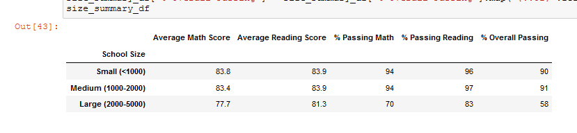

# School_District_Analysis

## Project Overview

The school board has notified Maria and her supervisor that the *students_complete.csv* file shows evidence of academic dishonesty; specifically, reading and math grades for Thomas High School ninth graders appear to have been altered. Although the school board does not know the full extent of the academic dishonesty, they want to uphold state-testing standards and have turned to Maria for help. We were asked to replace the math and reading scores for Thomas High School with NaNs while keeping the rest of the data intact. Then we re-did our school district analysis to verify how these changes affected the overall analysis.

Results of First District Analysis

Results of Second District Analysis

There were clearly some issues with the 9th grade reading and math results at Thomas High School as can be seen in the highlighted stats from the First and Second results above.

## School District Analysis Results

The first step in the analysis was to isolate all the 9th grade reading and math scores from the students_complete.csv file (read into the student_data_df DataFrame).

We created two filters to make this step easier. The filter called 'f_ths' will isolate students at Thomas High School. The filter called 'f_9th' will isolate 9th grade students. The 'loc[]' method call is used twice on the  student_data_df DataFrame. Both times the bitwise and operator ('&') combines the 'f_9th' and 'f_ths' filters to select rows in the DataFrame. The labels "reading_score" and "math_score" are used as column selectors, in combination with the 'filter' Series as a row selector, in order to set values to 'NaN', as shown below.

Validation that the previous step worked as desired, we used the 'info()' function to inspect results on the nullified results in isolation, and in comparison with the original data. Note that there were 461 nullified entries (the total number of 9th grade students at Thomas HS) out of a total of 39,170 entries (the total number of 9th-12th grade students at all District High Schools), as shown below.

## School District Analysis Summmary

#### 1. District Summary DataFrame

Before Nullifying 9th Grade Math & Reading Scores at Thomas HS

After Nullifying 9th Grade Math & Reading Scores at Thomas HS

#### 2. School Summary DataFrame

*After Nullifying 9th Grade Math & Reading Scores at Thomas HS*

*Before Nullifying 9th Grade Math & Reading Scores at Thomas HS*

#### 3. Top & Bottom Five Performing Schools

*After Nullifying 9th Grade Math & Reading Scores at Thomas HS*

*Before Nullifying 9th Grade Math & Reading Scores at Thomas HS*

#### 4. Average Math Scores for Each Grade Level From Each School

**Only difference is presence of 'NaN' for Thomas HS**

*After Nullifying 9th Grade Math & Reading Scores at Thomas HS*

*Before Nullifying 9th Grade Math & Reading Scores at Thomas HS*

#### 5. Average Reading Scores for Each Grade Level From Each School

**Only difference is presence of 'NaN' for Thomas HS**

*After Nullifying 9th Grade Math & Reading Scores at Thomas HS*

*Before Nullifying 9th Grade Math & Reading Scores at Thomas HS*

#### 6. Scores by School Spending per students

**No significant difference**

*After Nullifying 9th Grade Math & Reading Scores at Thomas HS*

*Before Nullifying 9th Grade Math & Reading Scores at Thomas HS*

#### 7. Scores by School Size

**No significant difference**

*After Nullifying 9th Grade Math & Reading Scores at Thomas HS*

*Before Nullifying 9th Grade Math & Reading Scores at Thomas HS*

#### 8. Scores by School Type

**No significant difference**

*After Nullifying 9th Grade Math & Reading Scores at Thomas HS*

*Before Nullifying 9th Grade Math & Reading Scores at Thomas HS*

